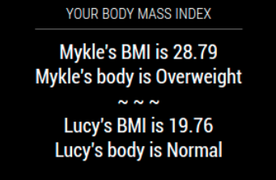

## MMM-BMI

**Body Mass Index**

## Piss off your wife or girlfriend

Put your name, height and weight into the config.js file.
Then, put your wife's, or your girlfriend's, height and weight into the config.js
and count the seconds until you are single again!

## Why would you use this module?

* As a motivation tool.
* You want a divorce.
* I begged you. **:^)**

## How it works

Simply enter your name, height and weight into the config.js file and this module
will calculate your Body Mass Index. I added the ability to enter a second set of 
value's for your significant other. 

## Examples



## Installation and requirements

* `git clone https://github.com/mykle1/MMM-BMI` into the `~/MagicMirror/modules` directory.

* `cd MMM-BMI` and run `npm install`


## Config.js entry and options
```
{
    disabled: false,
    module: "MMM-BMI",
    position: "top_center",
    config: {
        name: "Mykle",                    // Your name
        imperialUnits: true,		      // true or (false = metric)
        weight: "195",                    // lbs and inches or kg and m
        height: "69",                     // lbs and inches or kg and m
        herName: "Lucy",
        herWeight: "19",                 // lbs and inches or kg and m
        herHeight: "26",                 // lbs and inches or kg and m
        useHeader: true,                 // true if you want a header                 
        header: "YOUR BODY MASS INDEX",
        maxWidth: "350px",
    }
},  
```	
